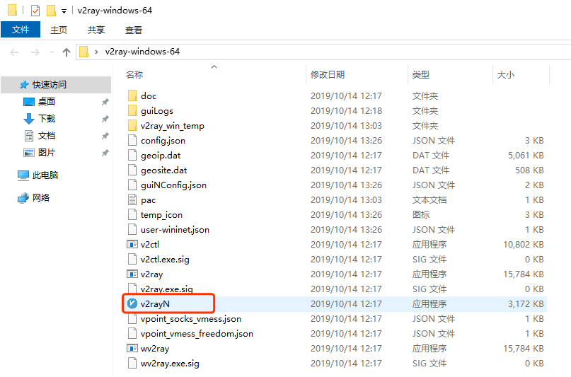
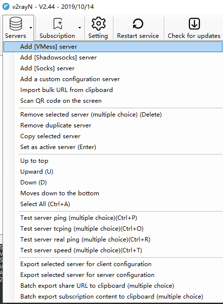

# For Windows User

**Reference**: [从零开始：史上最详尽V2Ray搭建图文教程](https://www.4spaces.org/digitalocean-build-v2ray-0-1/)

## Download

1. Download [v2ray-windows-64.zip Github Release](https://github.com/v2ray/v2ray-core/releases/tag/v4.20.0)
2. Download [v2rayN-v2rayN.exe-Github Release](https://github.com/2dust/v2rayN/releases/tag/3.1)
3. Unzip `v2ray-windows-64.zip`, and then copy `V2RayN.exe` into the output folder of `v2ray-windows-64`, i.e., `V2RayN.exe` and contents of `v2ray-windows-64.zip` are in the same folder.\


## Configuration

1. Run `V2RayN.exe` to configure.\
2. Then `Add [VMess] Server`.\

3. Import URL from clipboard.\
Simply copy the URL link from the administrator, and import it through this option.\

4. Save the configuration by press `OK`.
5. Enable HTTP proxy\

6. Choose HTTP proxy mode\
PAC mode is recommended. Global mode also works as well.\


# For macOS User

## Install [V2rayU](https://github.com/yanue/V2rayU)

Install with homebrew command

```shell
brew install --cask v2rayu
```

## Run V2rayU from the Launchpad.

1. Open Configure.\

2. Add new server and import settings with URL copied from administrator.\

3. Turn v2ray-core on and switch to PAC Mode.\

4. Change PAC rule to exclude Google Scholar. (**Unfortunately, Google Scholar blocked this IP.**)\


---

## Enjoy yourself with Google, Youtube, Dropbox, Docker, and etc.