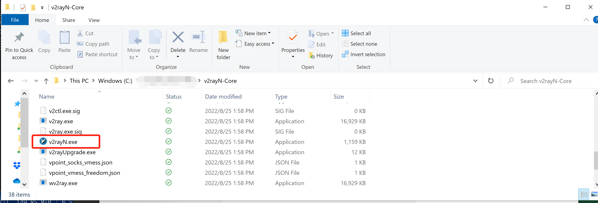
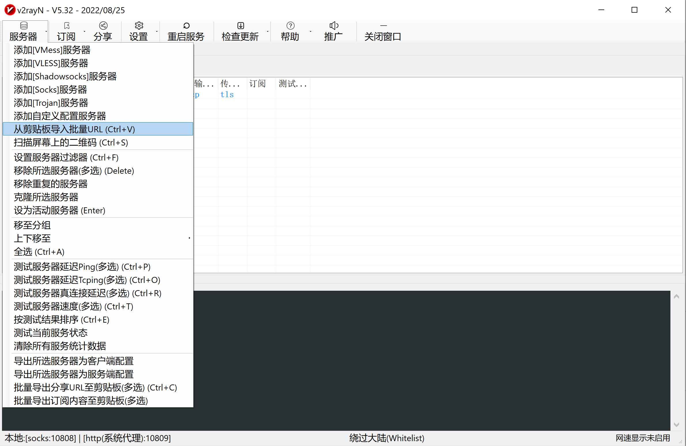
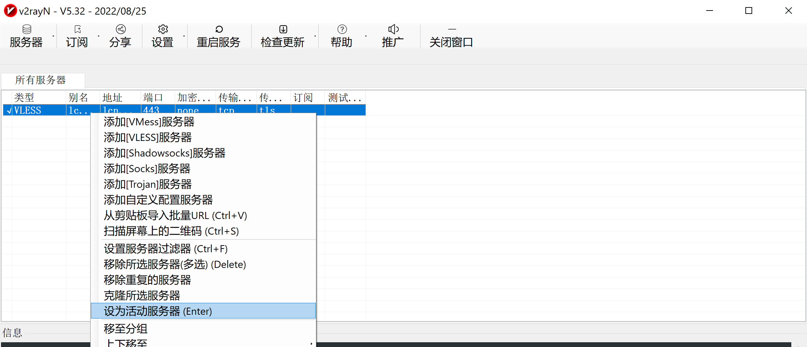
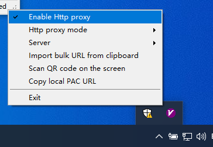
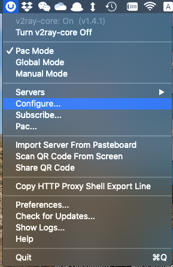
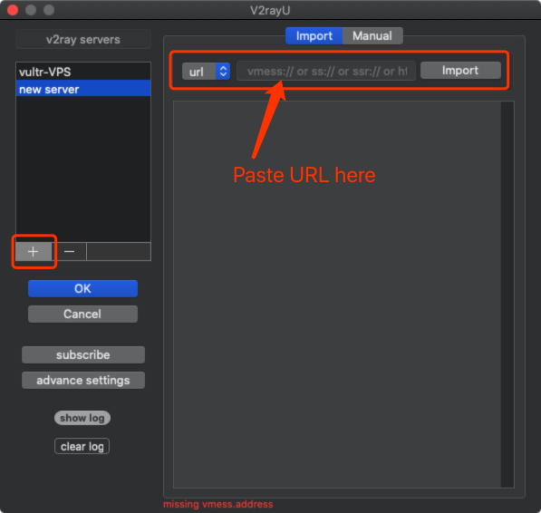
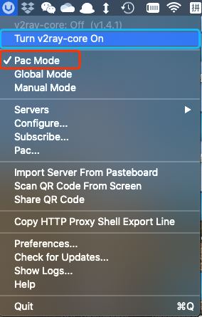

# For Windows User

**Reference**: [从零开始：史上最详尽V2Ray搭建图文教程](https://www.4spaces.org/digitalocean-build-v2ray-0-1/)

## Download
Download [v2rayN-Core.zip](https://github.com/2dust/v2rayN/releases/tag/5.32)

## Configuration

1. Run `V2RayN.exe` to configure.

2. Add new server.\
    Copy the URL from the administrator, and import it through the option below.\
    
    <!--  -->
3. Right-click to **activate** imported server (only required once).

4. Choose proxy mode\
Right click the icon of **v2rayN** in the taskbar, and switch the setting as shown below.


# For macOS User

## Install [V2rayU](https://github.com/yanue/V2rayU/tree/master)

1. **Install through homebrew**

    ```shell
    brew install --cask v2rayu
    ```
2. **Download the [latest version](https://github.com/yanue/V2rayU/releases)**

## Run V2rayU from the Launchpad.

1. Open Configure.\

2. Add new server and import settings with URL copied from administrator.\

3. Turn v2ray-core on and switch to PAC Mode.\

4. Change PAC rule to exclude Google Scholar. (**Unfortunately, Google Scholar blocked this IP.**)\


---

## Enjoy yourself with Google, Youtube, Dropbox, Docker, and etc.